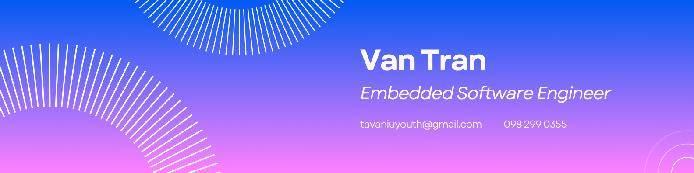

# 👋 Hello World! I'm Van, an Embedded Software Engineer:
👨🏼‍🎓 Studying Electrical Engineering at International University, VNU-HCM   ⚙️ Skilled in C/C++, Microcontrollers (STM32, ESP32, Arduino), RTOS, and Communication Protocols.   🔍 Always learning & building innovative embedded systems!

# 💻 Tech Stack:
          

<picture>
  <source media="(prefers-color-scheme: dark)" srcset="https://raw.githubusercontent.com/dylantranee/dylantranee/output/github-snake-dark.svg" />
  <source media="(prefers-color-scheme: light)" srcset="https://raw.githubusercontent.com/dylantranee/dylantranee/output/github-snake.svg" />
  
</picture>
